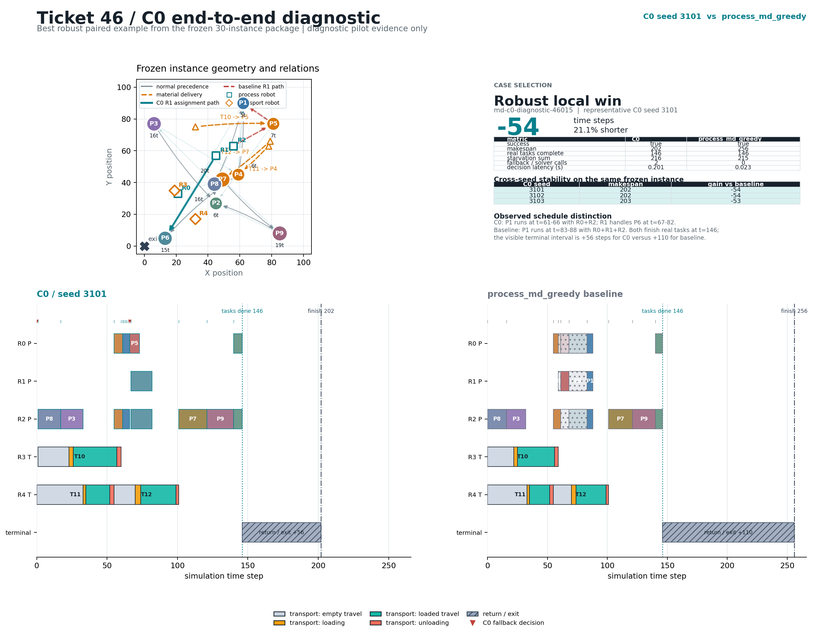

# Ticket 46 C0 Best Example



## Selected case

- Frozen instance: `md-c0-diagnostic-46015`
- Representative rollout: `C0`, model seed `3101`
- Paired baseline: `process_md_greedy`
- Makespan: `202` versus `256` (`54` time steps, `21.1%` shorter)
- Real tasks complete at `t=146` for both methods
- Material-starvation sum: `216` versus `215`
- C0 fallback calls: `2`; illegal assignments: `0`

The instance was selected from the four cases where all three C0 seeds beat the
paired baseline. It has the largest worst-seed gain: C0 seeds `3101/3102/3103`
finish in `202/202/203`, for gains of `54/54/53` time steps against the same
baseline.

The timeline separates real task completion from terminal return to the exit:
the visible post-task interval is `+56` steps for C0 and `+110` for the
baseline. The map highlights the different R1 assignment path and the three
material-delivery routes.

This is an illustrative local paired win from a diagnostic pilot. The aggregate
Ticket 46 report remains the source of truth and does not claim a stable overall
C0 improvement.

Re-render from the repository root with:

```text
